# Project 1 Planning: The Unofficial Guide

> Write this document before you write any pipeline code.
> Your spec and architecture diagram are what you'll use to direct AI tools (Claude, Copilot, etc.) to generate your implementation — the more specific they are, the more useful the generated code will be.
> Update the Retrieval Approach and Chunking Strategy sections if you change your approach during implementation.
> Update this file before starting any stretch features.

---

## Domain

<!-- What domain did you choose? Why is this knowledge valuable and hard to find through official channels? -->
I choose UCSD Dining hall menus, services, and dining plans as the domain. It may be hard to find specific information about UCSD dining services because their dining system works differently were most other univiersities have a buffet-style dining model, where students pay with a meal plan and can take multiple servings during a meal period. Additionally, UCSD menus can be very extensive.

---

## Documents

<!-- List your specific sources: URLs, subreddit names, forum threads, or file descriptions.
     Aim for at least 10 sources that together cover different subtopics or perspectives within your domain. -->

| # | Source | Type | URL or file path |
|---|--------|------|-----------------|
| 1 |Places to Eat at UCSD|PDF of Official Website|documents/Places to Eat at UCSD.pdf|
| 2 |Incoming Student Dining Plan
|Official Website|https://hdhdining.ucsd.edu/dining-plans/incoming.html|
| 3 |Continuing Student Dining Plan|Official Website|https://hdhdining.ucsd.edu/dining-plans/continuing.html|
| 4 |64 Degrees|Official Website|https://hdh-web.ucsd.edu/dining/apps/diningservices/Restaurants/Venue_V3?locId=64&subLocNum=00&locDetID=18&dayNum=0|
| 5 |Restaurants at Sixth College|Official Website|https://hdh-web.ucsd.edu/dining/apps/diningservices/Restaurants/Venue_V3?locId=37&subLocNum=00&locDetID=24&dayNum=0|
| 6 |Canyon Vista Marketplace|Official Website|https://hdh-web.ucsd.edu/dining/apps/diningservices/Restaurants/Venue_V3?locId=24&subLocNum=00&locDetID=11&dayNum=0|
| 7 |Ventanas|Official Website|https://hdh-web.ucsd.edu/dining/apps/diningservices/Restaurants/Venue_V3?locId=18&subLocNum=00&locDetID=8&dayNum=0|
| 8 |Triton2Go Mobile Ordering|Official Website|https://hdhdining.ucsd.edu/triton2go/index.html|
| 9 |Dining Accommodations|Official Website|https://hdhdining.ucsd.edu/nutrition-services/accommodations.html|
| 10 |Need food recommendations from dining halls.|UCSD Subreddit|https://www.reddit.com/r/UCSD/comments/1gsvgjl/need_food_recommendations_from_dining_halls/|

---

## Chunking Strategy

<!-- How will you split documents into chunks?
     State your chunk size (in tokens or characters), overlap size, and explain why those
     numbers fit the structure of your documents.
     A review-heavy corpus warrants different chunking than a long FAQ. -->

**Chunk size:**
- **Dining Plans (Incoming & Continuing Students):** 100 tokens per chunk, where 1 chunk = 1 plan option (e.g. Triton Gold, Triton Blue). These pages are structured like comparison tables with small, self-contained entries.
- **Menu Items (64 Degrees, Restaurants at Sixth College, Canyon Vista Marketplace, Ventanas):** 100–150 tokens per chunk, where 1 chunk = 1 menu item including name, station, allergens, dietary tags, and ingredients. Items are already atomic and self-contained.
- **Places to Eat (Blink page):** 60–100 tokens per chunk, where 1 chunk = 1 venue row including name, description (truncated to 1–2 sentences), location, hours (flattened), and accepted payments.
- **Triton2Go FAQ:** 100–200 tokens per chunk, where 1 chunk = 1 Q&A pair. Some answers are brief, others involve multi-step explanations (e.g. deposit refund edge cases).
- **Dining Accommodations:** 150–300 tokens per chunk, split on section boundaries (h2/h3 headers). Sections contain cohesive policy information that should not be split mid-thought.
- **Reddit Recommendations:** 30–100 tokens per chunk, where 1 chunk = 1 comment. If a reply is only intelligible in the context of its parent comment, the parent and reply are bundled as a single chunk.

**Overlap:**
No overlap for any source except Dining Accommodations, which uses a 1–2 sentence overlap between consecutive sections to preserve context that bleeds across section boundaries (e.g. pronouns or references that depend on the preceding section).

**Metadata per chunk:**
- Menu items: `source`, `location`, `station`, `meal_period`, `date`
- Places to Eat: `source`, `venue_name`, `location`, `payments_accepted`
- Dining Plans: `source`, `plan_name`, `academic_year`
- Triton2Go FAQ: `source`, `question`
- Dining Accommodations: `source`, `section_heading`
- Reddit: `source`, `post_title`, `upvotes`, `date`, `is_reply_bundle`

**Reasoning:**
Dining plan entries are small and structured like a comparison table, so 1 plan = 1 chunk keeps each option retrievable independently. Menu items are already organized atomically by dish with consistent fields (name, allergens, ingredients, nutrition), so 1 item = 1 chunk avoids mixing unrelated dishes. The Blink Places to Eat page follows the same logic — 1 venue row = 1 chunk — though descriptions are truncated since station-level detail lives in the menu item chunks. Triton2Go content is a FAQ where each Q&A pair is self-contained, so pairing them avoids retrieving half an answer. Dining Accommodations is the only prose-heavy source where context can bleed across sections, justifying the small overlap. Reddit comments are individual opinions from different people, so merging them would corrupt retrieval; the only exception is threaded replies that are unintelligible without their parent.
---

## Retrieval Approach

<!-- Which embedding model are you using (e.g., all-MiniLM-L6-v2 via sentence-transformers)?
     How many chunks will you retrieve per query (top-k)?
     If you were deploying this for real users and cost wasn't a constraint, what tradeoffs
     would you weigh in choosing a different embedding model — context length, multilingual
     support, accuracy on domain-specific text, latency? -->

**Embedding model:**
For the embedding model use all-MiniLM-L6-v2 via sentence-transformers. The current chunk size for each page fits within the model because they all fall within the 256 context window, and majority of the conversations being held with the user are mostly questions to answer as conversational. There is not much analysis needed.
**Top-k:**
As for menu items we would want top 7 options to give the user a variety of options, as for places to eat we would want top 5 places to eat for smaller pool of options, then Policies and FAQ should be top 3 because we want precise answers to a certain question, dining plans should also be 3 since there is not much dining plans, and Reddit should be top 5 for accumulated recommendation after filtering by recency and upvotes to remove stale opinions.
**Production tradeoff reflection:**
Due to the smaller model, we will only be handling English the best compared to other languages. Due to the large amount of international students, their native language may not work as well. Analysis and interpretation of meals will not be too extensive for example, where a dish comes from or its origin. Additionally, with the smaller model trained on pre-existing text, it may not be familiar with UCSD specific terms like DD for dining dollars or Sixth representing Sixth College. Finally, when adding a new source, we will need to chunk it differently according to how much text it provides and the specificity of the information.
---

## Evaluation Plan

<!-- List your 5 test questions with their expected correct answers.
     Questions should be specific enough that you can judge whether the system's response
     is right or wrong. "What are good dining halls?" is too vague.
     "What do students say about wait times at [dining hall name] during lunch?" is testable. -->

| # | Question | Expected answer |
|---|----------|-----------------|
| 1 |I only eat 1–2 meals a day, what dining plan should I get?|Triton plan ($5,350) — lowest daily spend estimate at $20/day|
| 2 |What is good at Ventanas?|Chicken and Waffles and a Buffalo fried chicken plate, and Indian Food|
| 3 |Where can I get Poke?|Makai and Restaurants at Sixth College|
| 4 |What if I lose my to go container?|You will not be able to get your $5 deposit back for that container. You can continue to check out additional containers by paying the $5 refundable deposit.|
| 5 |What can I get if I'm allergic to peanuts?|all dining locations are peanut-free; pre-packaged peanuts sold in markets only; cross-contact in outside facilities not guaranteed|

---

## Anticipated Challenges

<!-- What could go wrong? Name at least two specific risks with reasoning.
     Consider: noisy or inconsistent documents, missing source attribution, off-topic
     retrieval, chunks that split key information across boundaries. -->

1. For overly specific queries as in what's the sodium content in the teriyaki chicken at Canyon Vista tonight, it may not have the right information. The menu is only a snapshot for a single day and RAG won't have access to what today's date is.

2. There are some sources with overlapping information and ambiguous venue names. Sources refer to the same physical locations inconsistently. Additionally, people generally would call a location at Sixth, or Sixth dining but user may need to specify Restaurants at Sixth.

3. Due to the Reddit Recommendations being around 1-2 years ago, the menu items may not reflect correctly to the more recent menus.

---

## Architecture

<!-- Draw a diagram of your pipeline showing the five stages:
     Document Ingestion → Chunking → Embedding + Vector Store → Retrieval → Generation
     Label each stage with the tool or library you're using.
     You can use ASCII art, a Mermaid diagram, or embed a sketch as an image.
     You'll use this diagram as context when prompting AI tools to implement each stage. -->

```mermaid
flowchart LR
    subgraph Sources
        S1[HDH menu pages]
        S2[Dining accommodations]
        S3[Triton2Go FAQ]
        S4[Dining plans]
        S5[old.reddit.com]
        S6[Blink PDF]
    end

    subgraph Ingestion["Document Ingestion"]
        I1[requests + BeautifulSoup]
        I2[pdfplumber]
    end

    subgraph Chunking["Chunking - Custom Python"]
        C1[Menu items: 100-150 tok]
        C2[Places to eat: 60-100 tok]
        C3[FAQ: 100-200 tok]
        C4[Policy prose: 150-300 tok]
        C5[Dining plans: 60-100 tok]
        C6[Reddit: 30-100 tok]
    end

    subgraph Embedding["Embedding + Vector Store"]
        E1[all-MiniLM-L6-v2 via sentence-transformers]
        E2[(ChromaDB)]
    end

    subgraph Retrieval["Retrieval"]
        R1[Metadata filter by source_type]
        R2[top-k query - k=3-10 by source]
    end

    subgraph Generation["Generation"]
        G1[Groq - llama-3.3-70b-versatile]
    end

    Sources --> Ingestion
    Ingestion --> Chunking
    Chunking --> Embedding
    E1 --> E2
    Q([User query]) --> Retrieval
    E2 --> Retrieval
    R1 --> R2
    Retrieval --> Generation
    Q --> Generation
    Generation --> A([Answer])
```

---

## AI Tool Plan

<!-- For each part of the pipeline below, describe:
     - Which AI tool you plan to use (Claude, Copilot, ChatGPT, etc.)
     - What you'll give it as input (which sections of this planning.md, which requirements)
     - What you expect it to produce
     - How you'll verify the output matches your spec

     "I'll use AI to help me code" is not a plan.
     "I'll give Claude my Chunking Strategy section and ask it to implement chunk_text()
     with my specified chunk size and overlap" is a plan. -->
## AI Tool Plan

### Stage 1: Document Ingestion
- **Tool:** Claude Code
- **Input:** The Sources and Architecture sections of this planning.md, plus the URLs for each HDH page and the Blink PDF
- **Expected output:** A `scraper.py` with separate functions per source type — `scrape_menu()`, `scrape_faq()`, `scrape_plans()`, `scrape_reddit()`, and `extract_pdf()` using pdfplumber for Blink
- **Verification:** Run each function and manually spot-check 3–5 rows of output against the actual live page to confirm names, allergens, hours, and prices are extracting correctly

### Stage 2: Chunking
- **Tool:** Claude Code
- **Input:** The Chunking Strategy section of this planning.md, specifying chunk sizes and metadata fields per source type
- **Expected output:** A `chunker.py` with a `chunk_documents()` function that accepts raw scraped data and returns chunks with the correct token size and metadata fields (`source_type`, `location`, `meal_period`, `date`, etc.) per source
- **Verification:** Print 2–3 sample chunks from each source type and manually confirm chunk boundaries, token counts, and metadata match the spec in planning.md

### Stage 3: Embedding + Vector Store
- **Tool:** Claude Code
- **Input:** The Retrieval Approach section of this planning.md, specifying all-MiniLM-L6-v2 and ChromaDB
- **Expected output:** An `embedder.py` that encodes chunks using sentence-transformers and stores them in ChromaDB with metadata fields attached as filterable attributes
- **Verification:** Query ChromaDB directly for a known item (e.g. "Steel Cut Oatmeal" from Canyon Vista) and confirm it returns the correct chunk with correct metadata

### Stage 4: Retrieval + Generation
- **Tool:** Claude Code
- **Input:** The Retrieval Approach section (top-k values per source type, metadata filter logic) and the Groq model name `llama-3.3-70b-versatile`
- **Expected output:** A `rag.py` that takes a user query, applies metadata filtering by source type, retrieves top-k chunks from ChromaDB, and passes them with the query to Groq for generation
- **Verification:** Run the 5 evaluation questions from the Test Queries section and manually check that each answer is grounded in the correct source type and matches the expected answer

**Milestone 3 — Ingestion and chunking:**

**Milestone 4 — Embedding and retrieval:**

**Milestone 5 — Generation and interface:**
